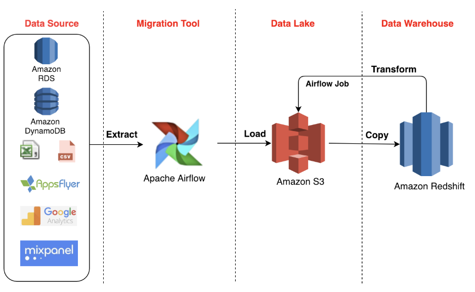

# Facebook Comments ETL Pipeline
An ETL pipeline designed to automate the extraction, transformation, and loading (ETL) of Facebook comments into a MySQL data warehouse. This project uses Airflow for pipeline orchestration, Selenium for web scraping, and custom Python scripts for data preprocessing and loading. The project is containerized with Docker for easy deployment and scaling.
> **Note:** If you just want to crawl Facebook comments, use the `crawler` module in the `src` directory.
## 📚 Table of Contents
- [Features](#-features)
- [Architecture](#-architecture)
- [Installation and Setup](#-installation-and-setup)
- [TODO](#-todo)

## 🚀 Features
- **Data Extraction:** Crawls comments from Facebook posts using Selenium and Facebook cookies for authentication.
- **Data Transformation:** Cleans raw data to remove noise and standardize text.
- **Data Loading:** Stores structured data in a MySQL table for analysis.
- **Pipeline Orchestration:** Automated scheduling and monitoring using Airflow.
- **Containerized Deployment:** Fully containerized with Docker for portability and scalability.

## 🏗️ Architecture
Workflow Overview:
1. **Extraction:** rawl comments from a specified Facebook post using Selenium.
2. **Transformation:** Clean and preprocess comments using a custom data cleaner.
3. **Loading:** Store cleaned data in a MySQL table for downstream analysis.


## 🛠️ Installation and Setup
### 1. **Clone the repository:**
```bash
git clone https://github.com/johnPa02/crawler_facebook_comment.git
cd crawler_facebook_comment
```
### 2. Configure environment variables
```
cp .env.example .env
```
### 3. **Build and run the Docker containers:**
```
docker-compose up --build
```

## ✅ TODO
- [ ] Integrate Google BigQuery for handling larger datasets.
- [ ] Implement PySpark for distributed data processing.
- [ ] Add dashboards for data visualization using Tableau or Google Data Studio.